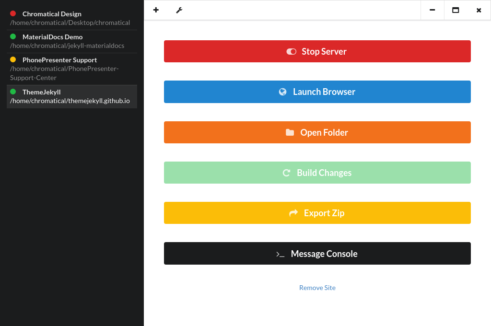

# Jekyll Commander
Manage Jekyll websites without the command line.



## Installation
Download and run the installer from the releases page.  Please note that, like Jekyll, Windows is not a supported platform.  However, Jekyll Commander will run on Windows (with a few bugs) if built using the Development method below.

## Configuration
Jekyll Commander runs out of the box on Linux.  Mac and Windows users must set the correct path to the Jekyll and Bundler scripts on their machine.

## Development
```
git clone https://github.com/chromatical/jekyll-commander
cd jekyll-commander
npm install
npm start
npm run dist #for building an installer file
```

## Credits
Jekyll Commander is built with [Electron](http://electron.atom.io/), [Vue.js](https://vuejs.org/), [jQuery](http://jquery.com/), and [Archiver](https://github.com/archiverjs/node-archiver) (for the Zip export feature).
